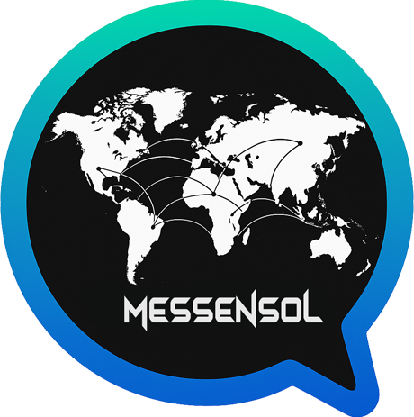

  

# 💬 MessenSOL — The Solana Messenger (Web3 Wallet-to-Wallet Chat)

**MessenSOL** is the decentralized **Solana Messenger** designed for **secure wallet-to-wallet communication** with **end-to-end encryption (E2EE)** and **zero-access architecture**.  
Built entirely on the **Solana blockchain**, it offers **fast, private, and censorship-resistant messaging** without phone numbers, emails, or centralized data collection.

🔗 **Live App:** [https://messensol.app](https://messensol.app)

---

## ⚡ Why Choose MessenSOL?

Traditional messengers rely on centralized servers and user identities.  
**MessenSOL** changes everything — it’s the **messenger of Web3**, where **your wallet is your identity** and **privacy is the default**.

### 🔐 Core Features

- 🔒 **End-to-End Encryption (E2EE)** — Messages are encrypted and decrypted only on your devices.  
- 🪙 **Wallet-to-Wallet Authentication** — Connect with **Phantom**, **Solflare**, or **Backpack**.  
- 💬 **Real-Time Off-Chain Messaging** — Fast, lightweight, fully encrypted communication.  
- 🧠 **Zero-Access Architecture** — Even MessenSOL servers cannot read message content.  
- ⚡ **Powered by Solana** — Ultra-fast and low-cost blockchain ecosystem.  
- 💸 **Token Transfers in Chat** — Send and receive **SOL** or **SPL tokens** directly in conversations.  
- ☁️ **Encrypted File Sharing** — Attachments stored securely off-chain (AWS S3).  

---

## 🧱 Tech Stack Overview

| Layer | Technologies |
|-------|---------------|
| **Frontend** | React · TypeScript · Vite |
| **Backend** | Node.js · Express · WebSocket |
| **Database** | MongoDB Atlas |
| **Blockchain** | Solana Web3.js · SPL Token |
| **Deployment** | Frontend → Vercel · Backend → Render |
| **Storage** | AWS S3 (Encrypted, Off-Chain) |

---

## 🌎 Project Links

| Resource | URL |
|-----------|-----|
| 🌐 **Live App** | [messensol.app](https://messensol.app) |
| 🧩 **Frontend Repo** | Private *(messensol-client)* |
| ⚙️ **Backend Repo** | Private *(messensol-server)* |
| 🐦 **X (Twitter)** | [@messensol](https://x.com/messensol) |
| 💬 **Contact** | messensol.app@protonmail.com |

---

## 🧭 Vision

Our mission is to make **MessenSOL the default messenger of the Solana ecosystem**, connecting wallets, communities, and users in a **private, borderless, Web3-native network**.

> “The future of communication is wallet-to-wallet.”

---

## 🔒 Security Architecture

MessenSOL is built around **End-to-End Encryption (E2EE)** and **Zero-Access Privacy**.  
Messages are encrypted locally on each client, transmitted via WebSocket, and decrypted only by recipients.  
The backend never has access to private message content or encryption keys.

Even attachments stored in **AWS S3** are **E2EE-protected**, ensuring no third party can view or intercept user data.

---

## 🧩 About the Project

**MessenSOL** is developed by **Viko Sotomura** and a small independent team focused on **privacy-first decentralized applications**.  
The project aims to merge **Web3 identity**, **Solana performance**, and **E2EE communication** into one seamless platform.

For partnerships, funding, or acquisition inquiries:  
📧 **messensol.app@protonmail.com**

---

## 📈 SEO & Discovery Keywords
> `Solana messenger`, `Solana chat`, `wallet-to-wallet messaging`, `crypto messenger`,  
> `Solana blockchain`, `Web3 messenger`, `decentralized chat`,  
> `E2EE`, `zero-access architecture`, `Solana wallet chat`, `Solana dapp`, `private crypto communication`

---

## 📜 Legal

- [Terms of Service](./TERMS.md)
- [Privacy Policy](./PRIVACY.md)

---

## 🪪 License

This repository serves as a **public showcase** for the **MessenSOL project**.  
All production codebases remain private.  
Logo, documentation, and assets © **MessenSOL 2025** – All rights reserved.
